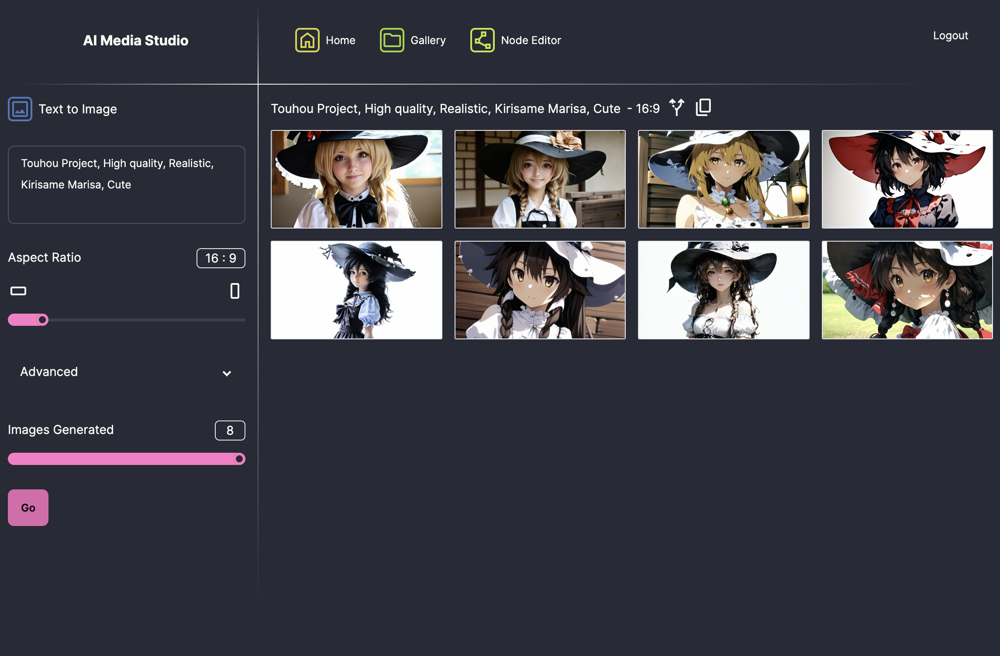
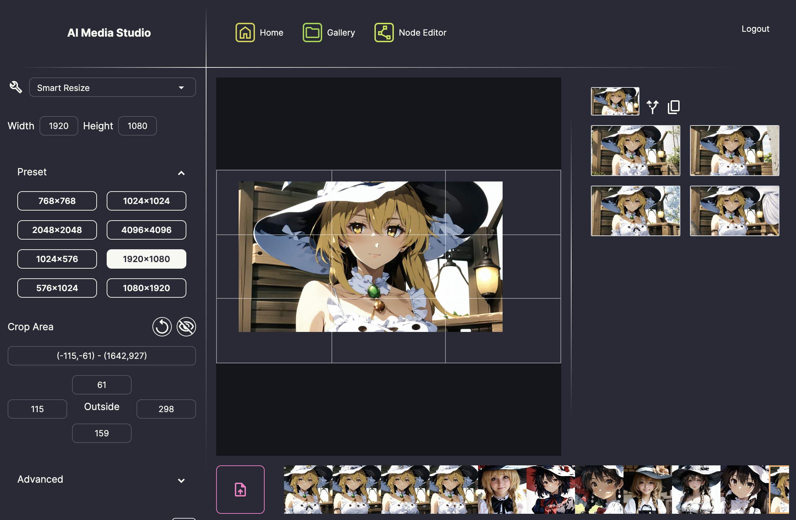
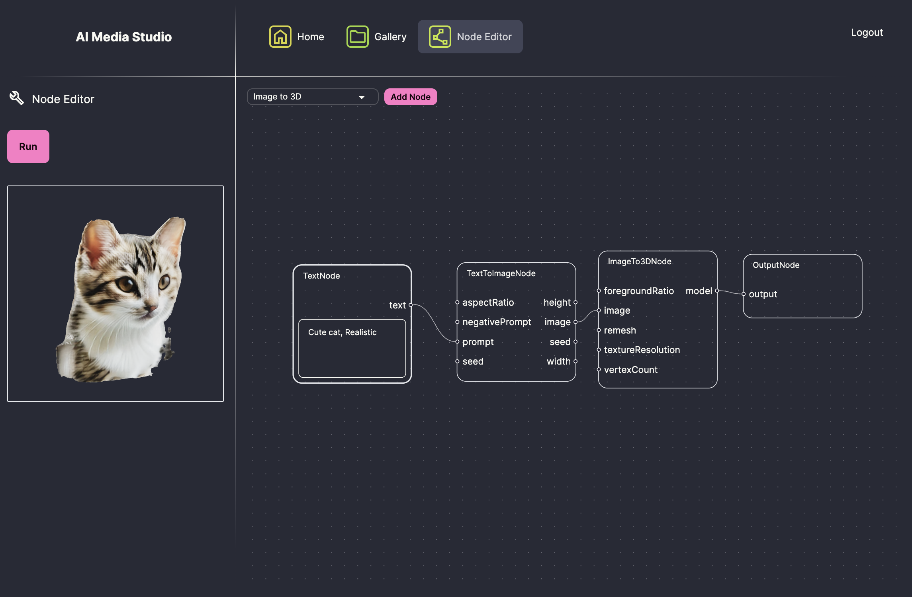

# AI Media Studio

`AI Media Studio` is a web application that leverages the power of Generative AI to
enable the generation and editing of images, videos, and 3D models.

Notable features include an intuitive and user-friendly interface, as well as highly extensible and customizable workflow control.

Generative AI technology can be challenging for many users to use intuitively,
easy-to-understand UI is essential. Moreover, combining Generative AI 
technologies with general image processing techniques further expands the
potential of the application.

## Screenshots







## Install and Build

```sh
$ npm install yarn
$ npx yarn
$ npx yarn build
```

## Run locally

```sh
$ vi ./src/constants.ts
# Edit STABILITY_AI_API_KEY
$ npx yarn dev
# And then access "http://localhost:3000" in your browser
```

Currently Standalone + [Stability AI REST APIs](https://platform.stability.ai/docs/api-reference)

Note: Generated and uploaded images will have gone
if you reload or leave the page

TODO: Persist them

## Tech stack

* TypeScript
* React
* Daisy UI + Tailwind CSS

We love lightweight approach.

## Objectives

**Making Generative AI More Practical.**

Generative AI holds immense potential, but unlocking its capabilities is not always easy for general users. Challenges include the difficulty of setting up the environment, managing complex parameters, and fine-tuning generated results.

`AI Media Studio` aims to address these issues by making Generative AI more practical and user-friendly. By offering an intuitive UI and enabling workflows that integrate multiple processes, it provides creators with a platform to unleash their creativity freely.

## Current Status

Currently in the pre-alpha stage, `AI Media Studio` is focused on validating its concept and is intended for personal use in local environments. There are still many challenges to address before it can be deployed on public servers for broader operational use.

## Intended Users

`AI Media Studio` is designed for professionals and prosumers who are deeply involved in creative fields. This includes graphic designers, illustrators, UI/UX designers, photographers, image editors, video creators, 3D modelers, and other content creators.

The primary devices for these users are desktops or laptops with large widescreen displays. While they may occasionally use mobile devices when away from their workstations, their focus remains on desktop-centric tasks.

These users typically have a clear vision of what they want to create, often starting with initial images or sketches. They rely heavily on editing tools rather than generation tools and prefer seamless integration with professional applications such as Photoshop and Blender.

## Design Principles

The design philosophy of `AI Media Studio` emphasizes simplicity, consistency, and f`unctionality to meet the needs of professional and prosumer users. Each Tool is built with an intuitive UI, ensuring that users can access and utilize its features effortlessly. For example, tools like Inpaint and Erase come with specialized brush UIs for masking.

`AI Media Studio` supports a variety of media types, including images, videos, and 3D models, to provide users with versatility in their creative workflows. The tool-centric design prioritizes the efficient application of tools across different media formats. This includes applying multiple tools sequentially, integrating various tools seamlessly, and retrying or revising tool usage as needed.

Discoverability is a key focus, with features that allow users to filter generated media by favorites, ratings, or tags, and track the relationships between generated and original media. Additionally, quick access to frequently used tools is provided directly from the top page, reducing unnecessary interactions and enabling fast workflows.

While `AI Media Studio` is desktop-first to cater to the demands of professional workstations, it incorporates responsive design to remain accessible on mobile devices. However, the primary emphasis is on delivering a robust and efficient experience for desktop and laptop users, who require large screens and precision in their creative tasks.

To maintain a lightweight application, `AI Media Studio` provides only essential AI-related features, leaving more complex tasks to professional desktop applications like Photoshop or Blender. Seamless import and export capabilities ensure easy integration with these tools, allowing users to focus on core functionalities without unnecessary distractions.

## Core software mechanisms

`AI Media Studio` employs a sophisticated yet efficient approach to ensure a consistent and intuitive user experience across Tools. The core mechanism revolves around automatic generation of UI and logic from well-defined structures, enabling both scalability and flexibility.

### Processing Units

At the heart of the system are `Processing Units`, which serve as minimal building blocks. Each `Tool` is a combination of these units, allowing for:

* Automatic generation of UI, pages, and menus directly from Tool definitions.
* High extensibility to create custom and intuitive interfaces for specific tools, such as the Mask Drawing UI for Erase/Inpaint or the Crop UI for Smart Resize.

This modular approach ensures that tools can integrate seamlessly with AI companies APIs and conventional image processing techniques, offering:

* Single API operations.
* Multi-API and regular processing combinations, such as the "Smart Resize" Tool that combines Outpaint API, cropping, and resizing.

TODO: Write the definition of `Tool`

TODO: Write documents about how to add Processing Units and Tools

### Benefits of Automatic Generation

The automatic generation mechanism guarantees a consistent UI/UX throughout the application. It simplifies the management of expanding APIs and processing combinations without unnecessary complexity. By reducing the need for differentiation between Tool functions like Generation and Editing, the system improves scalability as the number of Tools grows.

### Prototype Features

The current prototype showcases an early implementation of this system, including:

* Automatically generated logic, UI, pages, and menus based on tool definitions.
* Extensible features enabling tailored interfaces for specific tools.
* A framework that supports both standalone and integrated Tool functionalities.

This foundation enables `AI Media Studio` to adapt and evolve with minimal effort, ensuring a user-centric and scalable platform.

## Features

TODO: Add sreenshots or videos

### Easy media switch for a Tool

### Easy Tool switch for a media

### Easy sequential use of multiple tools on a single media

### Result review and comparison

### Special Intuitive UI for particular Tools

### Combination of APIs and Regular image processings

### Tool use history and Retry

### Generated media review

### Easy tracking of generated/original/variation medias

### Video and 3D model support

### User media upload

### Shortcuts to featured Tools from the Top page

### Advanced parameters

### Node based UI

### TODO: Favorite and Filtering

### TODO: Generated medias Gallery

### TODO: Zoom in/out

### TODO: Add Variation

### TODO: Download

### TODO: Download as High Quality with Upscale

### TODO: Layering

### TODO: Importing and Exporting PSD

### TODO: Node based generated media tracking

### TODO: Multiple media upload

### TODO: User media upload with Drag and Drop
